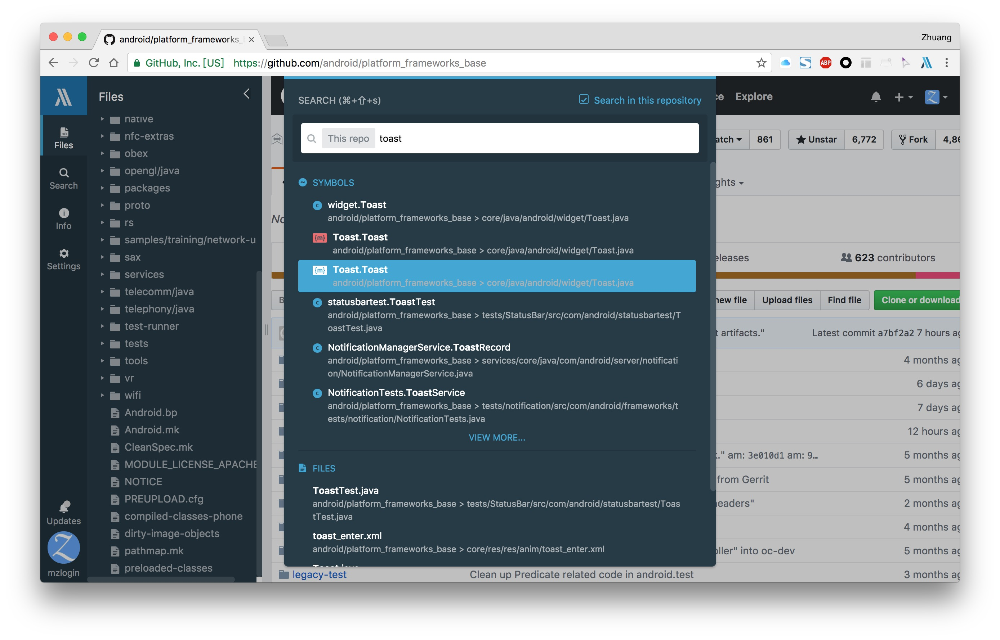
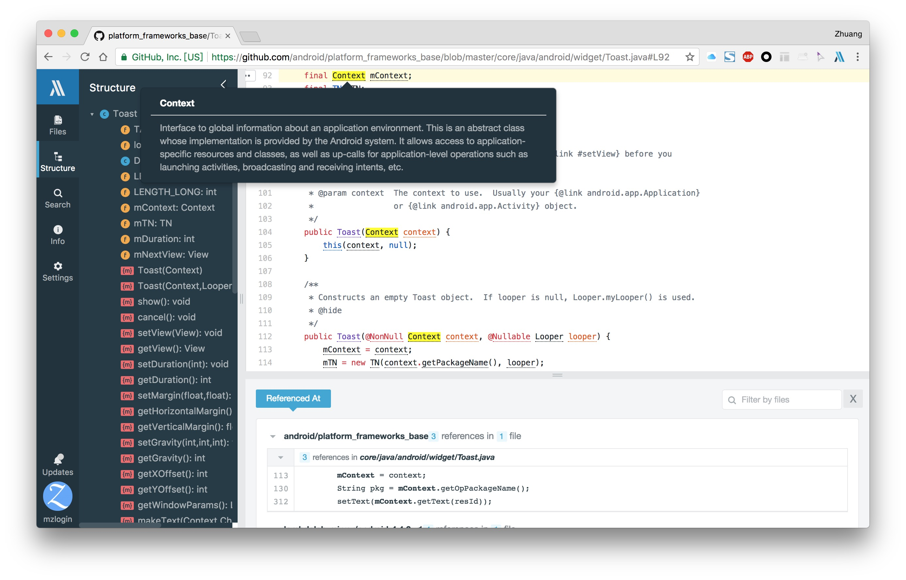

# 阅读源码工具选用

之前我写过一篇 [搭建大型源码阅读环境——使用 OpenGrok][1]，给大家介绍了一款开源的源码阅读工具的安装方法，实际到目前为止，OpenGrok 仍是我最喜爱的源码阅读工具之一。

本次 Android 源码阅读之旅，我也将继续使用 OpenGrok，有网络的时候使用在线的 <http://androidxref.com/>，离线时使用自己本地搭建的。

但同时在阅读 frameworks 源码时会首选使用 Chrome 插件 [Insight.io for GitHub][2] 来打开 GitHub 上的 frameworks base 镜像 [android/platform_frameworks_base][3]，它是一款强大的辅助工具，目录树、文件搜索、方法列表、定义跳转、引用查找等等都不在话下，要感受它的妙处可以安装起来体验，你一定会觉得值得拥有，先来几张图感受一下：

目录树、文件搜索：

方法列表、引用查找、弹出注释：

然后，找不到的定义去 OpenGrok，找不到的文件去 OpenGrok，双剑在手，天下我有……其实，也不是很爽，:cry:，啥时候 Insight.io 有完整的 Android 源码就好了。

[1]: http://mazhuang.org/2016/12/14/rtfsc-with-opengrok/
[2]: https://chrome.google.com/webstore/detail/insightio-for-github/pmhfgjjhhomfplgmbalncpcohgeijonh
[3]: https://github.com/android/platform_frameworks_base
